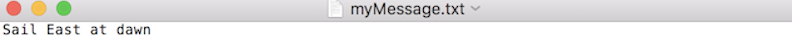

# Message Encrypt

The program asks the user for the name of a .txt file to be encrypted/decrypted (and for the public and private keys if the user has selected to decrypt), and uses the RSA algorithm and optimal asymmetric encryption padding to encrypt/decrypt the message.

## Installing

Pull the directory as is.  On the command line, run `pip install -r requirements.txt`.  This command will install the necessary pycrypto library (pycrypto 2.6.1).

## Example Encryption

The program prompts the user to select encrypt or decrypt. If the user selects encrypt, the program will prompt the user to input the name of the text file containing the message to be encrypted. It will then output a text file containing an encrypted message, a text file containing a public key, and a text file containing a private key.  
If we have a .txt file "myMessage":  
  
saved in the current directory, and we run  
`python messageEncrypt.py`  

we will receive the prompt:   
"Would you like to encrypt or decrypt a message"  
Answer with "Encrypt", and the following prompt will appear  
"Enter the name of the text file containing your message to be encrypted or decrypted:"  
Reply with the name of the .txt file we want to encrypt which is "myMessage.txt".  
The program will then perform the encryption.  When encryption is complete the program displays on the command line "Please find a file named encryptedMessage.txt containing your encrypted message, a file named publicKey.txt containing your public key which may be stored anywhere and a file named privateKey.txt which must be stored safely".  All of the specified files will be found in current the directory.  

## Example Decryption

Explain what these tests test and why

## Implementation

In the encryption process of the RSA algorithm, I used the Rabin Miller Primality Test to test whether the large primes I was generating using the random library were random.
Also in the encryption process of the RSA algorithm, I used a recursive GCD algorithm in order to calculate the modular inverse, which serves as the private key.

## Built With

* [random](The Python Standard Library: Lib/random.py) - Library used in RSA implementation
* [math](The Python Standard Library) - Dependency Management
* [Crypto](https://github.com/dlitz/pycrypto) - Used hash functions from this library to implement padding.

## License

This project is licensed under the MIT License. The rest are copyright/licensed by their respective authors.

## Acknowledgments

* Rajesh Pavuluru, Indiana State University: http://cs.indstate.edu/~rpavuluru/Abstract.pdf.  Implemented the Rabin Miller Primality test by reading this paper.  The primality test is used when generating large primes in the RSA algorithm.

